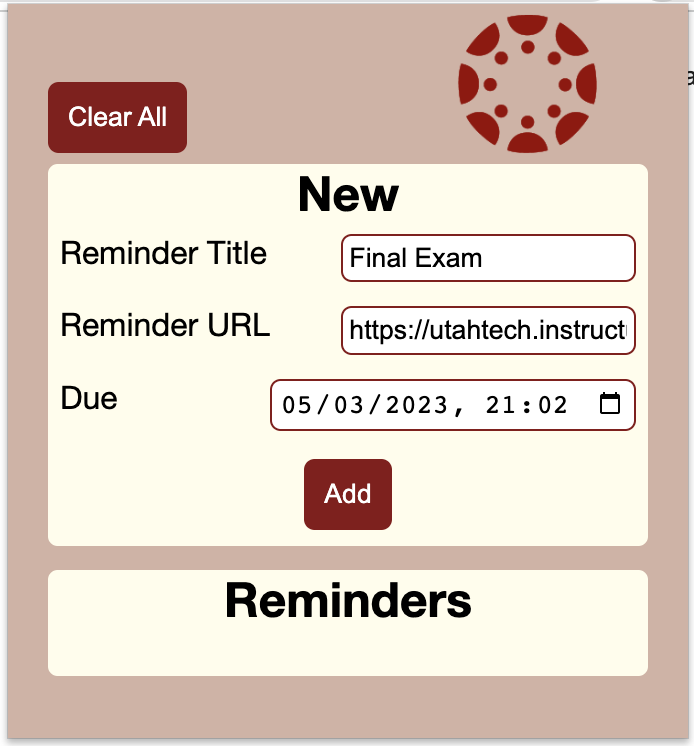
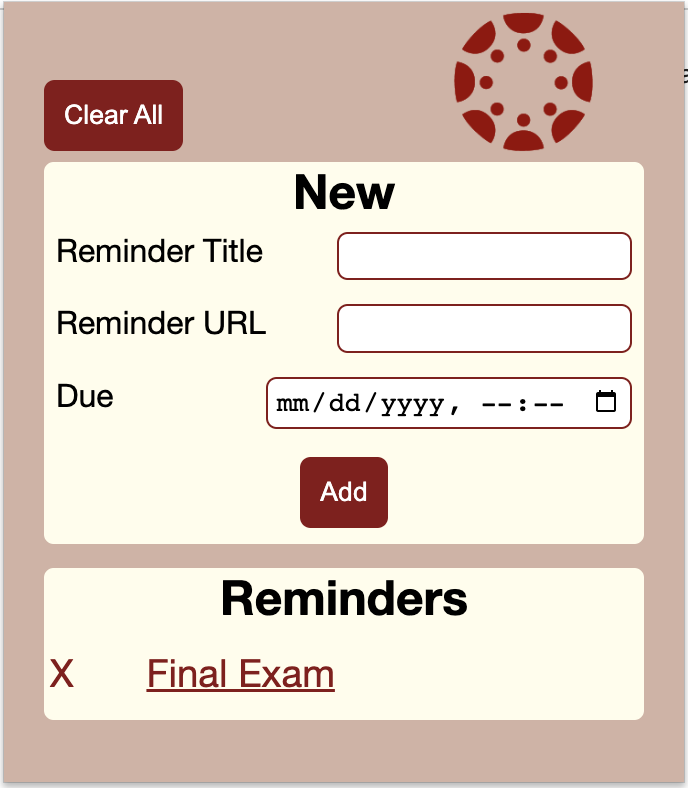

# canvas-helper
This is a Chrome extension we created for our Human-Computer Interaction Design class. It was originally meant to be integrated into Canvas, but we were unable to get access from our school's Canvas admin, so we had to change things a little. Currently it's still designed to be used with Canvas, but the lack of API lets it be used for any other task or website. Canvas Helper offers fields for the name of the assignment, the assignment page, and the due date. You can click on the name of the assignment (once created) to open a new tab to that assignment page. When the due date approaches, you will get a browser notification. You can choose to snooze or complete the task. If you click on the notification banner, it will also open a new tab to the assignment page.

## Screenshots

